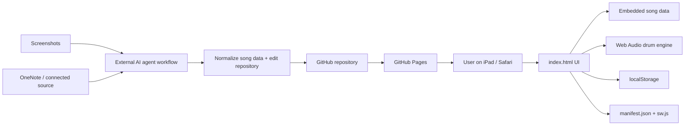

# Architecture — Guitar Drum

_Canonical technical architecture. Updated 2026-09-20._

## 1. Architecture summary

Guitar Drum hiện là **static, client-side PWA** chạy trên Safari/iPad và được deploy bằng GitHub Pages.

Không có backend, server database hoặc runtime AI integration.



## 2. Runtime components

### `index.html`

Hiện chứa cả:

- HTML layout;
- CSS responsive UI;
- JavaScript application logic;
- song catalog/data;
- chord transposition;
- playback state;
- Web Audio drum synthesis;
- line navigation;
- local persistence.

Đây là kiến trúc intentionally simple cho prototype. Agent không nên tự tách framework/build system nếu chưa có yêu cầu rõ.

### Song data

Song data hiện nằm trong object `songs` ở JavaScript trong `index.html`.

Mỗi bài có các thuộc tính chính:

- `title`
- `artist`
- `meta`
- `baseKey`
- `defaultBpm`
- optional `preferFlats`
- `rows`

Mỗi row hiện có dạng khái niệm:

```js
[
  "Section name",
  beatCount,
  ["text/chord part", "Chord", "text/chord part", ...]
]
```

Ví dụ:

```js
["Verse 1", 8, ["F", " Có giấc mơ nào êm ", "C7", " đềm..."]]
```

Chord tokens được nhận diện riêng để transpose và render thành chip hợp âm.

## 3. Chord transposition

- 12 semitone note map.
- Có sharp và flat display sets.
- `baseKey` là pitch class 0–11.
- Tone được chọn là pitch class đích.
- Shift được tính modulo 12.
- Phần suffix của hợp âm được giữ nguyên sau root note, ví dụ m7, 7, slash chord, b5...

Điểm cần bảo toàn: dữ liệu lời và chord token phải được tách đúng; nếu chord bị dính vào text thì transpose sẽ không hoạt động.

## 4. Playback model

Playback không dùng file audio backing track.

Drum được synthesize bằng Web Audio API:

- kick;
- snare;
- hi-hat;
- click dùng cho count-in.

Scheduler:

- tick định kỳ;
- schedule audio trước một khoảng ngắn;
- BPM quyết định quarter-note duration;
- 4 beat count-in trước playback;
- row duration được xác định bởi `beatCount` của từng row;
- `songBeat` được map sang row để đổi highlight.

### Giới hạn hiện tại

- Timing của từng dòng là dữ liệu thủ công, không được suy ra từ audio thật.
- Nhịp hiện tại được thiết kế chủ yếu cho 4/4.
- Drum là accompaniment đơn giản, không mô phỏng arrangement gốc của bài.

## 5. State persistence

State được lưu trong `localStorage`.

Theo từng bài, app lưu:

- current row;
- selected key;
- BPM;
- Show all / focus mode.

Ngoài ra lưu bài hát mở gần nhất.

Không có sync giữa thiết bị.

## 6. PWA layer

- `manifest.json`: metadata để install/Add to Home Screen.
- `sw.js`: service worker/cache behavior.
- `.nojekyll`: phục vụ static site trên GitHub Pages.
- `.github/workflows/pages.yml`: deployment workflow.

## 7. Deployment

Source of truth: GitHub repository.

Target runtime: GitHub Pages.

Default branch: `main`.

Không thêm hosting/backend mới nếu chưa có requirement.

## 8. Import architecture

Import ảnh/OneNote hiện **không chạy trong web app**.

Đây là workflow ngoài runtime:

1. Người dùng cung cấp ảnh hoặc nguồn OneNote.
2. Agent đọc nội dung.
3. Agent chuẩn hóa metadata, sections, lyrics, chords và beat count.
4. Agent cập nhật song data trong repository.
5. Kiểm tra syntax + behavior.
6. Commit/PR.
7. GitHub Pages deploy phiên bản mới.

### Batch rule cho ảnh

Agent phải giữ ảnh trong cùng một batch và chỉ bắt đầu xử lý khi người dùng nói **“làm”**.

## 9. Architecture constraints cho agent khác

Không tự ý:

- thêm React/Vue/Next hoặc build pipeline chỉ để refactor;
- thêm backend/database;
- chuyển song data sang service ngoài;
- đổi deployment khỏi GitHub Pages;
- bỏ localStorage;
- thay đổi batch rule của ảnh;
- tự động “sửa” lời/hợp âm nếu chưa chắc nguồn.

Mọi thay đổi lớn về architecture phải được ghi lại trong tài liệu và có lý do dựa trên requirement mới.
