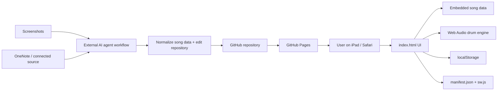

# Architecture — Guitar Drum

_Canonical technical architecture. Updated 2026-09-20._

## 1. Architecture summary

Guitar Drum hiện là **static, client-side PWA** chạy trên Safari/iPad và được deploy bằng GitHub Pages.

Không có backend, server database hoặc runtime AI integration.



## 2. Runtime components

### `index.html`

Hiện chứa cả:

- HTML layout;
- CSS responsive UI;
- JavaScript application logic;
- song catalog/data;
- chord transposition;
- playback state;
- Web Audio drum synthesis;
- line navigation;
- local persistence.

Đây là kiến trúc intentionally simple cho prototype. Agent không nên tự tách framework/build system nếu chưa có yêu cầu rõ.

### Guitar Follow POC

`guitar-follow.js` bổ sung một vertical slice realtime để drummer phản ứng theo lực đàn acoustic qua microphone.

Runtime flow hiện tại:

1. user bật **Auto Follow** trong Drummer UI;
2. module xin microphone qua `getUserMedia` với echo cancellation để giảm việc mic nghe lại drum từ loa iPad;
3. Web Audio `AnalyserNode` đo RMS mỗi ~80 ms và chuyển sang dB;
4. adaptive noise floor + rolling peak chuẩn hóa tín hiệu thành guitar energy 0–1;
5. smoothing + hysteresis + hold time phân loại thành `silent / soft / medium / big`;
6. các state ổn định được map sang Intensity `1 / 2 / 3 / 5` và phát event input để dùng lại drum engine hiện có;
7. onset timestamps gần đây được gom trong cửa sổ ~8 giây; các inter-onset interval được normalize theo octave tempo vào range BPM hiện tại để tạo tempo estimate;
8. Tempo Follow chỉ kích hoạt khi có đủ onset, confidence vượt ngưỡng và candidate BPM giữ ổn định khoảng 2.4 giây; sau đó BPM chỉ dịch 1 BPM mỗi ~850 ms về target;
9. Bar-sync estimator fold onset theo beat period, so accent strength ở 4 vị trí của ô nhịp để tìm beat 1; candidate downbeat phải đủ confidence và giữ cùng phase khoảng 2.6 giây;
10. khi beat 1 đáng tin, module so predicted guitar downbeat với next unscheduled drummer beat; chỉ khi lệch không quá ~85 ms mới nudge timing và re-index quarter counter về beat 1, không thay đổi song position;
11. UI hiển thị energy meter, mic dB, strum-rate, tempo estimate/confidence và trạng thái Bar `learning / stable / synced`.

POC hiện follow **dynamics + tempo + beat-1/bar phase + next-section prediction + harmonic position**. `guitar-follow.js` lấy FFT/chroma 12 pitch-class trong cửa sổ ngay sau strum onset, so với tập chord thực tế của bài đã transpose sang **sounding key** (bao gồm trường hợp dùng capo), yêu cầu chord candidate ổn định qua nhiều frame rồi ghi thành chord-event sequence. Chuỗi 3–5 chord gần đây được so với `getHarmonicTimeline()` derive từ chord tokens của từng row. Auto re-anchor chỉ chạy khi best sequence match có score cao, margin đủ xa ứng viên thứ hai, tempo/bar confidence ổn định và target cách vị trí hiện tại ít nhất 4 beat. Nếu progression lặp ở nhiều nơi, margin thấp nên app chỉ hiển thị `ambiguous` và không nhảy. Main app chỉ thực hiện pending harmonic anchor ở beat 1 kế tiếp; manual jump/Fill vẫn override.

### Tone detection + Capo

Tone/capo đã được tích hợp vào UI chính qua `tone.js`.

Runtime flow:

1. user mở một trong 3 bài hiện tại;
2. `tone.js` đọc reference của bài từ `tone-references.json`;
3. microphone được lấy bằng `getUserMedia`;
4. autocorrelation trên Web Audio waveform ước lượng pitch theo frame;
5. pitch được gom thành pitch-class distribution trong khoảng 8 giây;
6. distribution được so với reference profile của đúng bài để xếp hạng transpose offset;
7. detected sounding key được dùng để sinh các phương án:
   - bấm trực tiếp, hoặc
   - chuyển chord shapes về các guitar key phổ biến (G/C/D/A/E) và dùng capo;
8. khi user chọn phương án, `index.html` hiển thị chord shapes tương ứng và lưu `capo`, `soundingKey`, `shapeKey` trong state của bài.

`tone-references.json` hiện là **harmonic-profile-v1**, được build trước cho 3 bài từ harmonic/chord data hiện có. Đây chưa phải melody phrase reference lấy từ audio. Nếu test thực tế cho thấy key gần nhau dễ nhầm, hướng nâng cấp đã chốt là precompute melody reference theo phrase từ nguồn audio/MIDI đáng tin cậy.

`tone-poc.html` vẫn được giữ lại như prototype cũ, nhưng feature người dùng sử dụng nằm trong app chính.

### Song data

Song data hiện nằm trong object `songs` ở JavaScript trong `index.html`.

Mỗi bài có các thuộc tính chính:

- `title`
- `artist`
- `meta`
- `baseKey`
- `defaultBpm`
- optional `preferFlats`
- optional `drumStyle`
- optional `drumArrangement`
- `rows`

Mỗi row hiện có dạng khái niệm:

```js
[
  "Section name",
  beatCount,
  ["text/chord part", "Chord", "text/chord part", ...]
]
```

Ví dụ:

```js
["Verse 1", 8, ["F", " Có giấc mơ nào êm ", "C7", " đềm..."]]
```

Chord tokens được nhận diện riêng để transpose và render thành chip hợp âm.

`drumArrangement` là map theo exact section name. Mỗi entry có thể chứa:

- `pattern`: groove variant như `air`, `pocket`, `build`, `open`, `openPlus`, `ride`, `halftime`, `outro`, `finale`;
- `gain`: hệ số lực riêng của section;
- `label`: mô tả ngắn hiển thị trong Drummer UI;
- `autoFillIn`: nếu true, scheduler tự chơi fill 4 beat ngay trước khi section bắt đầu.

## 3. Chord transposition

- 12 semitone note map.
- Có sharp và flat display sets.
- `baseKey` là pitch class 0–11.
- Tone được chọn là pitch class đích.
- Shift được tính modulo 12.
- Phần suffix của hợp âm được giữ nguyên sau root note, ví dụ m7, 7, slash chord, b5...

Điểm cần bảo toàn: dữ liệu lời và chord token phải được tách đúng; nếu chord bị dính vào text thì transpose sẽ không hoạt động.

## 4. Playback model

Playback không dùng file audio backing track.

Drum được synthesize bằng Web Audio API:

- kick;
- snare;
- closed/open hi-hat;
- tom;
- crash/noise accent;
- click dùng cho count-in.

Scheduler:

- tick định kỳ;
- schedule audio trước một khoảng ngắn;
- BPM quyết định quarter-note duration;
- 4 beat count-in trước playback;
- row duration được xác định bởi `beatCount` của từng row;
- `songBeat` được map sang row để đổi highlight;
- ưu tiên exact section config trong `drumArrangement`; nếu không có thì section name được classify thành Intro / Verse / Pre / Chorus / Bridge / Interlude / Outro để lấy fallback groove;
- `Intensity` 1–5 được nhân với per-section `gain` và lưu per-song;
- Fill thủ công được queue tới đầu ô nhịp 4/4 kế tiếp;
- auto-fill tìm section target bắt đầu sau đúng 4 beat; nếu target có `autoFillIn`, fill chạy xuyên 4 beat trước đó và kết thúc ngay lúc vào section;
- khi đổi section không có fill, engine thêm transition accent ngắn.

### Giới hạn hiện tại

- Timing của từng dòng là dữ liệu thủ công, không được suy ra từ audio thật.
- Nhịp hiện tại được thiết kế chủ yếu cho 4/4.
- Drum đã có arrangement riêng cho 3 bài và POC nghe **guitar intensity + tempo + beat-1/bar phase + next-section intent** qua mic. Section transition vẫn dựa trên known song map và energy trend; chưa nhận chord change trực tiếp từ audio.

## 5. State persistence

State được lưu trong `localStorage`.

Theo từng bài, app lưu:

- current row;
- selected key;
- BPM;
- drummer intensity;
- Show all / focus mode.

Ngoài ra lưu bài hát mở gần nhất.

Không có sync giữa thiết bị.

## 6. PWA layer

- `manifest.json`: metadata để install/Add to Home Screen.
- `sw.js`: service worker/cache behavior.
- `.nojekyll`: phục vụ static site trên GitHub Pages.
- `.github/workflows/pages.yml`: deployment workflow.

## 7. Deployment

Source of truth: GitHub repository.

Target runtime: GitHub Pages.

Default branch: `main`.

Không thêm hosting/backend mới nếu chưa có requirement.

## 8. Import architecture

Import ảnh/OneNote hiện **không chạy trong web app**.

Đây là workflow ngoài runtime:

1. Người dùng cung cấp ảnh hoặc nguồn OneNote.
2. Agent đọc nội dung.
3. Agent chuẩn hóa metadata, sections, lyrics, chords và beat count.
4. Agent cập nhật song data trong repository.
5. Kiểm tra syntax + behavior.
6. Commit/PR.
7. GitHub Pages deploy phiên bản mới.

### Batch rule cho ảnh

Agent phải giữ ảnh trong cùng một batch và chỉ bắt đầu xử lý khi người dùng nói **“làm”**.

## 9. Architecture constraints cho agent khác

Không tự ý:

- thêm React/Vue/Next hoặc build pipeline chỉ để refactor;
- thêm backend/database;
- chuyển song data sang service ngoài;
- đổi deployment khỏi GitHub Pages;
- bỏ localStorage;
- thay đổi batch rule của ảnh;
- tự động “sửa” lời/hợp âm nếu chưa chắc nguồn.

Mọi thay đổi lớn về architecture phải được ghi lại trong tài liệu và có lý do dựa trên requirement mới.


### Sensor Fusion / PerformanceState (Follow v2)

`guitar-follow.js` now treats intensity, tempo, bar/downbeat, section-energy prediction, and harmonic-position matching as separate evidence streams. A central `performanceState` arbitrates them into modes such as `acquiring`, `listening`, `locked`, `following`, `ambiguous`, `transition`, and `reposition`.

Key rules:

- Section and harmonic detectors no longer directly trigger transport actions.
- Harmonic candidates are fused with exact-chord count, uniqueness/margin, bar confidence, tempo confidence, section support, and a light continuity prior.
- A harmonic auto-reposition requires the raw best harmonic match and fused best candidate to point to the exact same row/beat, plus high score/margin and a stable candidate window.
- Repeated/ambiguous progressions move `PerformanceState` to `ambiguous`; no position jump occurs.
- Section transitions are considered only when the next-section energy predictor is ready. Strong harmonic evidence that disagrees with that next section suppresses the transition.
- A shared fusion cooldown prevents a section fill and a harmonic re-anchor from competing in the same musical moment.

This creates one decision authority for the drummer while keeping each detector independently debuggable.


### Stop / Resume Intent

Follow v2 now treats silence and re-entry as musical intent rather than only low volume. A reliable strum onset refreshes `lastMusicalActivityAt`. Roughly 1.7 s without new guitar activity requests `THIN`, where the drum engine suppresses fills and plays a sparse kick/hat/snare texture. Roughly 3.8 s of silence requests `HOLD`; the engine waits for the next beat 1, freezes `songBeat`, keeps only an internal silent clock, and clears old tempo/bar/chord evidence. On new playing, the fusion layer enters `RE-LOCK` and requires fresh tempo confidence, beat-1 phase stability, and several recent onsets. While held, the silent transport may hard-align its clock to the next detected guitar downbeat; only then is `REJOIN` queued. Re-entry happens on beat 1 with a light crash and the normal groove resumes. Manual play/jump/pause controls override auto hold, and disabling Auto Follow releases any thin/hold state.


### Predictive Transition Planner

Follow v2 now separates **decision time** from **performance time**. Once tempo/bar are locked and `sectionPrediction` is stable, the planner combines section confidence, guitar energy trend, arrangement gain delta, current intensity, bar confidence, tempo confidence, harmonic agreement, and distance to the next section. It produces a plan state such as `STAY`, `BUILD`, `FILL-SMALL`, `FILL-MEDIUM`, or `FILL-BIG`.

A plan must remain stable before it can be armed. When armed, the main drum engine stores the target section and fill style but keeps the current groove running. It only starts the 1-bar fill when the target section is within the final 4 beats, then anchors/crashes into the target on beat 1. If a plan somehow reaches the target late, a fail-safe anchors without leaving a stuck pending plan.

Fill rendering now has three intensity classes (`small`, `medium`, `big`) with three deterministic variants per class. The planner rotates variants to reduce repetition. Existing automatic fills are suppressed while a predictive transition is pending, so two fill systems cannot compete.


### Humanization / Performance Layer

The drum synth now separates **musical timing decisions** from **hit performance**. The scheduler still owns the exact beat/grid and all follow/re-sync logic; before each synthesized kick/snare/hat/tom/crash, a deterministic humanization layer applies a small per-hit timing and velocity offset based on song beat, quarter, instrument voice and hit serial.

Key rules:

- `Human feel` is user-adjustable from 0–100% and persists per song; default is 55%.
- Beat-1 kick/crash timing is strongly protected (very small timing range) so Humanization cannot undo bar/downbeat sync.
- Snare can sit slightly late for a natural backbeat; hats get the largest timing/velocity variation and small filter/decay changes for articulation.
- Fills use reduced timing variation versus normal groove so target beat 1 stays reliable.
- Ghost snare notes are context-aware and only appear in eligible pocket/build/open patterns when Human feel is above a minimum amount. Their occurrence is deterministic, not random-at-runtime, which keeps debugging/reproducibility possible.
- Drum timbre also varies subtly: kick start frequency, snare/hat filter cutoff, hat/open-hat decay, tom pitch and crash brightness.

This layer is independent of microphone Auto Follow, so the drummer can sound less mechanical even when follow features are disabled.


### Clean Mic / Bleed + Vocal Rejection

The POC does **not** perform full source separation. Instead it uses a low-latency rejection layer designed for the actual iPad use case: the app knows exactly when its own synthesized drum hits are scheduled, so the drum engine emits `guitar-drum-self-hit` metadata containing voice, predicted performance time and hit power. `guitar-follow.js` keeps a short history of those events and compares them with the live microphone spectrum.

Every analysis frame now computes spectral flux, spectral flatness and low/mid/high-band energy ratios. Near a known self-drum hit, the analyzer estimates a `drumPenalty` based on the scheduled voice and whether the observed spectrum resembles that voice (for example low-heavy energy near a kick or noise/high-band energy near snare/crash). This penalty does **not** hard-mask the microphone because real guitar strums often happen on the same beat. Instead it raises the onset threshold unless guitar transient/mid-band evidence is strong enough.

A lightweight `voiceLike` score downweights sustained mid-band, low-transient input that is more consistent with singing than a guitar strum. Clean mic also reduces contaminated energy before dynamics classification, avoids teaching self-drum peaks into the adaptive mic range, and rejects chord frames that look strongly like self-drum/voice contamination. Chord recognition additionally requires minimum chroma diversity so a single sung pitch is less likely to look like a full chord.

UI exposes `Clean mic` as an A/B toggle plus an `Input` diagnostic state (`GUITAR / VOICE / DRUM / MIX / QUIET`) with spectral-flux, self-drum-mask and accepted/rejected onset counts. These labels are heuristics for debugging, not ground-truth source classification.


### Debug Session / Telemetry Recorder

The Follow panel includes a local-only debug recorder intended for real-device tuning on iPad. It samples a compact state snapshot roughly every 250 ms (about 4 Hz) and records important state-signature changes plus user `Mark` events. The recorder does **not** capture microphone audio or waveform samples.

Each snapshot can include transport/song position, mic energy/classification, Clean Mic spectral metrics, accepted/rejected onset counters, tempo/bar confidence, chord/harmonic match, section prediction, Sensor Fusion state, transition plan, intensity/human-feel controls, and stop/resume state. Session size is bounded by ring limits (7,200 samples and 1,200 events; roughly 30 minutes at the current sample rate).

Export uses a versioned JSON schema (`guitar-drum-debug-v1`). On supported iOS/iPadOS browsers it first tries the native Share sheet with a JSON file; otherwise it falls back to a local download. No telemetry is uploaded automatically. The exported file is intended to be attached back to an agent for threshold/timing analysis.


### Mic Calibration Mode

Calibration is a local 5-stage wizard embedded in the Follow panel: `Quiet`, `Drum only`, `Guitar only`, `Voice only`, and `Full mix`. Each stage is user-started after the environment is prepared and captures only numerical spectral/energy features for roughly 5–7 seconds; no audio is stored.

During calibration, normal Follow actions are suspended: tempo/bar may still be estimated for observation, but BPM steering, beat-phase correction, intensity changes, fills, holds/re-entry decisions and song-position actions are not allowed to fire from the calibration material.

The resulting versioned `calibrationProfile` is stored locally in the existing Follow settings. It derives a quality score and a bounded sensitivity recommendation (±6 dB), then learns/blends thresholds including base onset-rise, minimum guitar energy/evidence, self-drum rejection, vocal rejection, voice transient ceiling, input-class gates and stricter chord contamination gates. If source separation in the samples is weak, the profile quality falls and learned values are blended back toward the v22/v23 defaults rather than trusted fully.

`Clean mic` and chord/onset logic read `calibrationThresholds()` at runtime. With no profile, the original default thresholds remain effectively unchanged. Debug JSON includes the active calibration profile so future analysis can reproduce which thresholds were in effect.


### Follow Health / Fail-safe Mode

A dedicated Health layer now sits above detector confidence and below transport actions. It computes a smoothed score from live guitar evidence, self-drum/vocal contamination, a rolling 10-second accepted-vs-rejected onset ratio, tempo confidence, bar/downbeat confidence, harmonic certainty and calibration quality. Critical drum/voice contamination may cap the raw score even when tempo/bar appear confident from false onsets.

Health has hysteretic modes: `GREEN / Full Auto`, `YELLOW / Safe Follow`, and `RED / Manual Safe`. GREEN permits all current automation. YELLOW continues dynamics, BPM/bar following and conservative next-section transitions, but blocks harmonic song-position re-anchor and caps planned fills at medium. RED blocks automated intensity changes, BPM steering, beat-1 correction, harmonic re-position and predictive section transitions. Silence-driven THIN/HOLD remains available so genuine stopping does not run the song forward; automatic rejoin waits until Health recovers from RED.

If Health drops to RED, the Follow layer calls the main transport's fail-safe cancellation hook to discard pending AI section/harmonic anchors. A GREEN→YELLOW downgrade also cancels pending Full-Auto actions so an older high-risk decision is not executed after confidence falls. If a fill is already sounding, it may finish acoustically, but its pending section anchor is removed. When Health recovers from RED, the current detected dynamics level is re-applied so intensity automation does not remain stuck at a stale value.

Health score, component scores, mode and permissions are exposed through `GuitarFollowAPI` and included in debug telemetry.
