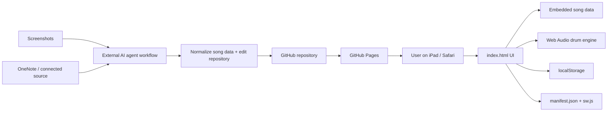

# Architecture — Guitar Drum

_Canonical technical architecture. Updated 2026-09-20._

## 1. Architecture summary

Guitar Drum hiện là **static, client-side PWA** chạy trên Safari/iPad và được deploy bằng GitHub Pages.

Không có backend, server database hoặc runtime AI integration.



## 2. Runtime components

### `index.html`

Hiện chứa cả:

- HTML layout;
- CSS responsive UI;
- JavaScript application logic;
- song catalog/data;
- chord transposition;
- playback state;
- Web Audio drum synthesis;
- line navigation;
- local persistence.

Đây là kiến trúc intentionally simple cho prototype. Agent không nên tự tách framework/build system nếu chưa có yêu cầu rõ.

### Guitar Follow POC

`guitar-follow.js` bổ sung một vertical slice realtime để drummer phản ứng theo lực đàn acoustic qua microphone.

Runtime flow hiện tại:

1. user bật **Auto Follow** trong Drummer UI;
2. module xin microphone qua `getUserMedia` với echo cancellation để giảm việc mic nghe lại drum từ loa iPad;
3. Web Audio `AnalyserNode` đo RMS mỗi ~80 ms và chuyển sang dB;
4. adaptive noise floor + rolling peak chuẩn hóa tín hiệu thành guitar energy 0–1;
5. smoothing + hysteresis + hold time phân loại thành `silent / soft / medium / big`;
6. các state ổn định được map sang Intensity `1 / 2 / 3 / 5` và phát event input để dùng lại drum engine hiện có;
7. onset timestamps gần đây được gom trong cửa sổ ~8 giây; các inter-onset interval được normalize theo octave tempo vào range BPM hiện tại để tạo tempo estimate;
8. Tempo Follow chỉ kích hoạt khi có đủ onset, confidence vượt ngưỡng và candidate BPM giữ ổn định khoảng 2.4 giây; sau đó BPM chỉ dịch 1 BPM mỗi ~850 ms về target;
9. Bar-sync estimator fold onset theo beat period, so accent strength ở 4 vị trí của ô nhịp để tìm beat 1; candidate downbeat phải đủ confidence và giữ cùng phase khoảng 2.6 giây;
10. khi beat 1 đáng tin, module so predicted guitar downbeat với next unscheduled drummer beat; chỉ khi lệch không quá ~85 ms mới nudge timing và re-index quarter counter về beat 1, không thay đổi song position;
11. UI hiển thị energy meter, mic dB, strum-rate, tempo estimate/confidence và trạng thái Bar `learning / stable / synced`.

POC hiện follow **dynamics + tempo + beat-1/bar phase**, nhưng **chưa tự suy ra section/chord position**. Song position/section vẫn do song map/manual timing kiểm soát. Các estimator cố ý bảo thủ để tránh mic bleed hoặc pattern syncopated kéo drummer sai nhịp.

### Tone detection + Capo

Tone/capo đã được tích hợp vào UI chính qua `tone.js`.

Runtime flow:

1. user mở một trong 3 bài hiện tại;
2. `tone.js` đọc reference của bài từ `tone-references.json`;
3. microphone được lấy bằng `getUserMedia`;
4. autocorrelation trên Web Audio waveform ước lượng pitch theo frame;
5. pitch được gom thành pitch-class distribution trong khoảng 8 giây;
6. distribution được so với reference profile của đúng bài để xếp hạng transpose offset;
7. detected sounding key được dùng để sinh các phương án:
   - bấm trực tiếp, hoặc
   - chuyển chord shapes về các guitar key phổ biến (G/C/D/A/E) và dùng capo;
8. khi user chọn phương án, `index.html` hiển thị chord shapes tương ứng và lưu `capo`, `soundingKey`, `shapeKey` trong state của bài.

`tone-references.json` hiện là **harmonic-profile-v1**, được build trước cho 3 bài từ harmonic/chord data hiện có. Đây chưa phải melody phrase reference lấy từ audio. Nếu test thực tế cho thấy key gần nhau dễ nhầm, hướng nâng cấp đã chốt là precompute melody reference theo phrase từ nguồn audio/MIDI đáng tin cậy.

`tone-poc.html` vẫn được giữ lại như prototype cũ, nhưng feature người dùng sử dụng nằm trong app chính.

### Song data

Song data hiện nằm trong object `songs` ở JavaScript trong `index.html`.

Mỗi bài có các thuộc tính chính:

- `title`
- `artist`
- `meta`
- `baseKey`
- `defaultBpm`
- optional `preferFlats`
- optional `drumStyle`
- optional `drumArrangement`
- `rows`

Mỗi row hiện có dạng khái niệm:

```js
[
  "Section name",
  beatCount,
  ["text/chord part", "Chord", "text/chord part", ...]
]
```

Ví dụ:

```js
["Verse 1", 8, ["F", " Có giấc mơ nào êm ", "C7", " đềm..."]]
```

Chord tokens được nhận diện riêng để transpose và render thành chip hợp âm.

`drumArrangement` là map theo exact section name. Mỗi entry có thể chứa:

- `pattern`: groove variant như `air`, `pocket`, `build`, `open`, `openPlus`, `ride`, `halftime`, `outro`, `finale`;
- `gain`: hệ số lực riêng của section;
- `label`: mô tả ngắn hiển thị trong Drummer UI;
- `autoFillIn`: nếu true, scheduler tự chơi fill 4 beat ngay trước khi section bắt đầu.

## 3. Chord transposition

- 12 semitone note map.
- Có sharp và flat display sets.
- `baseKey` là pitch class 0–11.
- Tone được chọn là pitch class đích.
- Shift được tính modulo 12.
- Phần suffix của hợp âm được giữ nguyên sau root note, ví dụ m7, 7, slash chord, b5...

Điểm cần bảo toàn: dữ liệu lời và chord token phải được tách đúng; nếu chord bị dính vào text thì transpose sẽ không hoạt động.

## 4. Playback model

Playback không dùng file audio backing track.

Drum được synthesize bằng Web Audio API:

- kick;
- snare;
- closed/open hi-hat;
- tom;
- crash/noise accent;
- click dùng cho count-in.

Scheduler:

- tick định kỳ;
- schedule audio trước một khoảng ngắn;
- BPM quyết định quarter-note duration;
- 4 beat count-in trước playback;
- row duration được xác định bởi `beatCount` của từng row;
- `songBeat` được map sang row để đổi highlight;
- ưu tiên exact section config trong `drumArrangement`; nếu không có thì section name được classify thành Intro / Verse / Pre / Chorus / Bridge / Interlude / Outro để lấy fallback groove;
- `Intensity` 1–5 được nhân với per-section `gain` và lưu per-song;
- Fill thủ công được queue tới đầu ô nhịp 4/4 kế tiếp;
- auto-fill tìm section target bắt đầu sau đúng 4 beat; nếu target có `autoFillIn`, fill chạy xuyên 4 beat trước đó và kết thúc ngay lúc vào section;
- khi đổi section không có fill, engine thêm transition accent ngắn.

### Giới hạn hiện tại

- Timing của từng dòng là dữ liệu thủ công, không được suy ra từ audio thật.
- Nhịp hiện tại được thiết kế chủ yếu cho 4/4.
- Drum đã có arrangement riêng cho 3 bài và POC nghe **guitar intensity + tempo + beat-1/bar phase** qua mic, nhưng arrangement vẫn thủ công/rule-based; chưa nhận chord change hoặc section trực tiếp từ guitar.

## 5. State persistence

State được lưu trong `localStorage`.

Theo từng bài, app lưu:

- current row;
- selected key;
- BPM;
- drummer intensity;
- Show all / focus mode.

Ngoài ra lưu bài hát mở gần nhất.

Không có sync giữa thiết bị.

## 6. PWA layer

- `manifest.json`: metadata để install/Add to Home Screen.
- `sw.js`: service worker/cache behavior.
- `.nojekyll`: phục vụ static site trên GitHub Pages.
- `.github/workflows/pages.yml`: deployment workflow.

## 7. Deployment

Source of truth: GitHub repository.

Target runtime: GitHub Pages.

Default branch: `main`.

Không thêm hosting/backend mới nếu chưa có requirement.

## 8. Import architecture

Import ảnh/OneNote hiện **không chạy trong web app**.

Đây là workflow ngoài runtime:

1. Người dùng cung cấp ảnh hoặc nguồn OneNote.
2. Agent đọc nội dung.
3. Agent chuẩn hóa metadata, sections, lyrics, chords và beat count.
4. Agent cập nhật song data trong repository.
5. Kiểm tra syntax + behavior.
6. Commit/PR.
7. GitHub Pages deploy phiên bản mới.

### Batch rule cho ảnh

Agent phải giữ ảnh trong cùng một batch và chỉ bắt đầu xử lý khi người dùng nói **“làm”**.

## 9. Architecture constraints cho agent khác

Không tự ý:

- thêm React/Vue/Next hoặc build pipeline chỉ để refactor;
- thêm backend/database;
- chuyển song data sang service ngoài;
- đổi deployment khỏi GitHub Pages;
- bỏ localStorage;
- thay đổi batch rule của ảnh;
- tự động “sửa” lời/hợp âm nếu chưa chắc nguồn.

Mọi thay đổi lớn về architecture phải được ghi lại trong tài liệu và có lý do dựa trên requirement mới.
